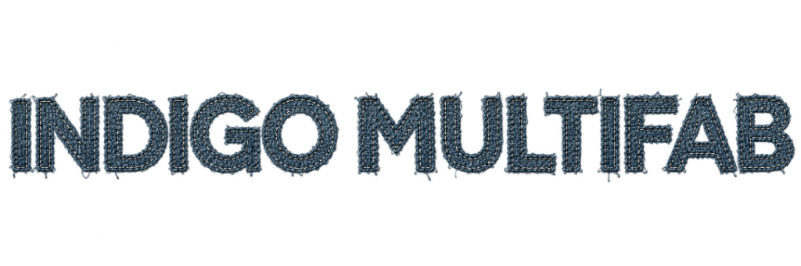

<div align="center">
  

  ### Premium Denim & Textile Manufacturing

  [](https://indigo-sable.vercel.app/)
  
  
  
  <p align="center">
    <a href="https://indigo-sable.vercel.app/"><strong>Explore the Live Site »</strong></a>
    <br />
    <br />
    <a href="https://indigo-sable.vercel.app/">Live Demo</a>
    ·
    <a href="https://github.com/iamritikarsh/INDIGO/issues">Report Bug</a>
    ·
    <a href="https://github.com/iamritikarsh/INDIGO/issues">Request Feature</a>
  </p>
</div>

---

## ✦ About The Project

**Indigo Multifab** is a beautifully crafted, static frontend website designed for a premium denim and textile manufacturing brand. It highlights the company's collections, commitment to quality, and manufacturing expertise with a clean, modern aesthetic. 

The website is fully responsive, ensuring a seamless experience across desktop, tablet, and mobile devices.

### ✨ Key Features
- **Modern & Elegant UI:** Carefully designed with a focus on typography, whitespace, and high-quality imagery to reflect a premium brand identity.
- **Responsive Design:** Fluid layouts that adapt perfectly to any screen size.
- **Fast & Lightweight:** Built with pure HTML and CSS for optimal performance and near-instant load times.
- **Vercel Deployment:** Configured for continuous deployment and blazing-fast global edge delivery via Vercel.

---

## 🛠 Built With

This project relies on core web technologies to deliver a fast and accessible experience without the overhead of heavy frameworks:

* **HTML5** - Semantic structure and accessibility.
* **CSS3** - Custom styling, animations, and responsive layouts.
* **Vanilla JavaScript** (if applicable) - For lightweight interactivity.

---

## 🚀 Getting Started

To get a local copy up and running, follow these simple steps.

### Prerequisites

You only need a web browser and a local server environment (optional but recommended for best results).

### Installation

1. **Clone the repository**
   ```sh
   git clone https://github.com/iamritikarsh/INDIGO.git
   ```
2. **Navigate to the project directory**
   ```sh
   cd INDIGO
   ```
3. **Run a local development server** (Using Python)
   ```sh
   python -m http.server 8000
   ```
4. **Open in your browser**
   Navigate to `http://localhost:8000`

---

## 🌐 Live Deployment

This project is automatically deployed on Vercel. Every push to the `master` branch triggers a new build.

**Live URL:** [https://indigo-sable.vercel.app/](https://indigo-sable.vercel.app/)

---

## 📞 Contact & Support

**Indigo Multifab** - [Live Website](https://indigo-sable.vercel.app/)

Project Link: [https://github.com/iamritikarsh/INDIGO](https://github.com/iamritikarsh/INDIGO)

---

<div align="center">
  <p>Crafted with precision & passion.</p>
</div>
